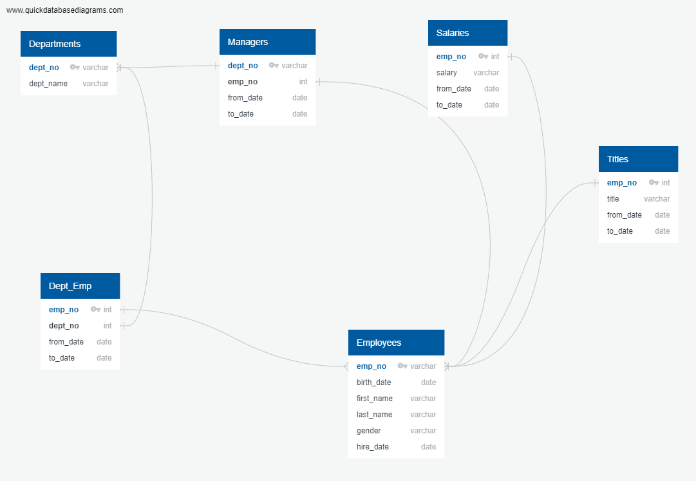

# Pewlett-Hackard-Analysis
Creating a databases for a company to analyze employee data based on exisiting relationships.

## Project overview
    Pewlett- Hackard company is going through major changes as long-time employees are approaching retirement age. In order to prepare for this, two different analyses were performed: finding number of retiring employees and number of employees ready for mentorship. This project is to help the company prepare accordingly and implement programs before the changes occur. 

## Summary of the results: 
    The company has a number of employees reaching retirement age as well as younger employees who are starting out in their first roles. It was important to provide adequate analysis for both components because as a company prepares for retiring employees, it can prepare for the future by prediciting the amount of jobs and roles they can offer. 
    The data was analyzed through 6 exisiting datasets. By creating a database, we were able to create more tables and relationships. One of the big issues was the Employees.csv file. This file contained all employees that the company has hired and continuing employees. Since this is a large list, it was important to filer by specific dates in order to get the correct list. For example,  by setting the to date to sometime in the year 9999, we were able to yield current employees instead of employees that have already left the company. This was particularily important for filtering the data to find the number of mentorship eligible employees. Another issue was duplicate values, specifically employees who have held multilpe titles in the company. Since both titles were in the system, it was important to only pick the recent title when doing any analysis. To fix this duplication problem, the partition code block was used, which paritioned the date by to_date in a descending order. This was the way to receive the recent title without altering other parts of the pre-existing table.
    The results of the analyses are as follows: Number of Retiring Employees by their Recent Title: 82, Number of Employees Eligible for Mentorship: 1,550. These were the findings of both csv files that were created. It can be seen that, there are more future employees in the company now instead of retiring employees. Even if all retiring employees were mentors, not all exisiting employees can be trained or prepared accodingly. Thus, the company will have to prepare for more mass-on boarding and training opportunities to get everyone geared for the changes. The analyses could have been strenghten if more speciffic data was included. For example, the amount of hiring per month the company is doing can be used to predict future employee numbers which can yield more results. Also, would the company consider an internship program to onboard more entry level employees to consolidate the retiring employees. There are many options for the company, given so many employees will continue to remain. The next steps would be to consider data based on titles. Titles indicate the roles within the company that everyone works towards. If the most popular or common title is analyzed, we can prepare for those positions to be filled. Also tirles based on necessity, will also be important to analyze. The advantage of this database is that it can be used to analyze past, present, and future data, thus provides more ability.  
## Recommendations 
    The data files can be filtered more before using them for the analyses. For example, birth_date can be provided in multiple and appropriate data files instead of just the main employees file. Birth_date can be used as a large filtering system especially when a company is worried about employees reaching retirement age. 
## ERD of the database

